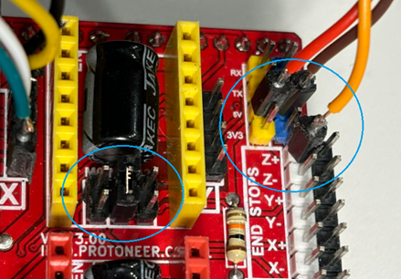
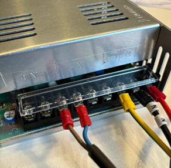

# Eggduino

## Intro

Arduino Firmware for Eggbot / Spherebot with Inkscape-Integration

Version 1.6a
tested with Inkscape Portable 0.91, Eggbot Extension and patched eggbot.py

Regards: Eggduino-Firmware by Joachim Cerny, 2015

Thanks for the nice libs ACCELSTEPPER and SERIALCOMMAND, which made this project much easier. Thanks to the Eggbot-Team for such a funny and enjoyable concept! Thanks to my wife and my daughter for their patience. :-)

## Features

- Implemented Eggbot-Protocol-Version 2.1.0
- Turn-on homing: switch-on position of pen will be taken as reference point.
- No collision-detection!!
- Supported Servos: At least one type ;-) I use Arduino Servo-Lib with TG9e- standard servo.
- Full Arduino-Compatible. I used an Arduino Uno
- Button-support (3 buttons)

Tested and fully functional with Inkscape.
This branch is tested and fully functional with the Arduino UNO R4.

## Arduino UNO R4

Powered with external 12V power.

|    |    |
| --- | --- |
|  |   |

## CNC Board

A CNC board makes it easy to add an external powersource, and re-arranges Arduino pins.
I used a CNC shield v3 board, with two TMC2209 driver boards, and a 24V 15A DC power supply.

Kudos to DDK for lending me two steppers, driver boards and a 24V power supply (see photos).

Find the wire pairs on the stepper motors. A wire pair has a low resistance (use your multi meter).
Consider one wire pair 'A', the other 'B'.
Wire the pair to the shield A-A-B-B. See photos.
If you think the motor is turning the wrong direction, then swap the wires of one pair.
Internet contains many different look-alike boards and wildly varying wiring suggestions (or incorrect wiring?).

- place the middle microstep jumper = 16 on the CNC Shield, one for each driver board (see photos).

|    |    |   |
| --- | --- | --- |
|  |   |  |

|    |    |
| --- | --- |
|  |   |

## Installation

Install this software on your Arduino

- Upload Eggduino.ino with Arduino-IDE or similar tool to your Arduino (i.e. Uno)
- In the Arduino Serial Monitor send the command 'v', with a carriage return.
  The Arduino should return the version of the software running, e.g.: 'EBBv13_and_above Protocol ...'
  If it does not return the version number, it is unlikely the Inktscape extension will be able to connect.

- Disable Autoreset on Arduino board (there are several ways to do this... Which one does not matter...)
  (on Arduino UNO R4 disabling autoreset was not needed)
- Install Inkscape Tools with Eggbot extension.
  Detailed instructions: (You yust need to complete Steps 1 and 2)
  <http://wiki.evilmadscientist.com/Installing_software>

- The code mixes the 'pen up' 'pen down' code.
  In the EggBot extension you can configure pen motion 'incorrectly' to fix this. (e.g. up is 50, down is 35)

- Because of an bug in the Eggbot-extension (Function findEiBotBoards()), the Eggduino cannot be detected by default.
  For now:

  - Go to your Inkscape-Installationfolder and navigate to subfolder .\App\Inkscape\share\extensions
  - Open file 'ebb_serial.py'
  - Ensure that the port list is scanned for the proper description of the VID:PID address.
  - For the Arduino UNO R4 this looks like:
    `if port[2].startswith("USB VID:PID=2341:1002"):`
